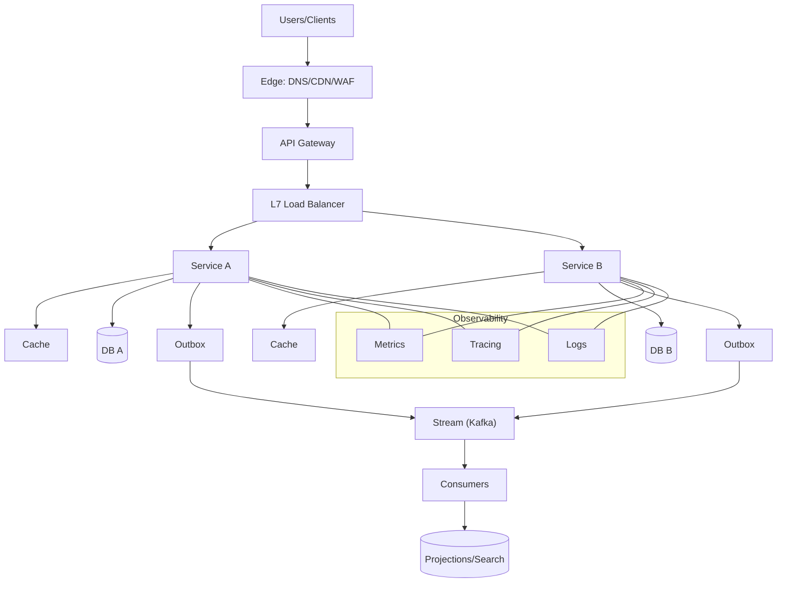

## 1. Interview Approach & Mindset

This playbook helps you drive system design interviews with clarity, structure, and trade-offs. Aim to cover breadth first, then choose 1–2 deep dives.

### Goals
- Communicate clearly, reason with data, and surface trade-offs
- Balance high-level architecture with low-level design details
- Demonstrate reliability, scalability, and operability thinking

### 8-Step Flow (timeboxed)
1. Clarify use cases and constraints (2–3 min)
   - Users, workflows, read/write ratio, expected traffic, latency targets
   - Success metrics, SLAs/SLOs, availability targets
2. Back-of-the-envelope capacity (3–5 min)
   - DAU/MAU, QPS, payload sizes, storage/day, bandwidth, growth
3. API sketch and data model (3–5 min)
   - Key endpoints or events, request/response, versioning, idempotency
   - Entities, relationships, indexes, hot partitions risk
4. High-level architecture (5–7 min)
   - Traffic entry (DNS, CDN, WAF), LB, services, caches, DBs, queues/streams
5. NFRs and bottlenecks (3–5 min)
   - Availability, consistency, durability, latency, throughput
6. Deep dive 1 (5–7 min)
   - E.g., write path: validation → idempotency → storage → async fanout
7. Deep dive 2 (5–7 min)
   - E.g., cache strategy and invalidation; or event processing + DLQ
8. Operability (2–3 min)
   - Observability, deployments, rollbacks, incident response, cost

### Talking in Trade-offs
- "We can choose A or B. A optimizes for X with costs Y; B optimizes for Z with risks W. Given NFRs, I’d start with A, measure, then evolve to B at scale."
- Name alternatives unprompted; justify with NFRs and data.

### Quick Capacity Estimation Template
- Peak QPS = DAU × actions/user/day ÷ seconds/day × peak factor
- Storage/day = events/day × avg size × replication
- Bandwidth = QPS × payload × 8 bits ÷ compression ratio
- Cache hit goal = 80–95% for hot paths; estimate origin load accordingly

### API and Data Model Template
- Public API: resources, verbs, pagination, filtering, idempotency, error format
- Events: name, schema/version, key/partitioning strategy
- Data model: entities, access patterns, critical indexes, uniqueness guarantees

### Architecture Checklist
- Entry: DNS, Anycast, CDN, WAF, API gateway
- LB: L4/L7, health checks, connection reuse, TLS termination
- Services: sync (REST/gRPC) vs async (events), timeouts, retries, circuit breaker
- State: cache tiers, DB choice and scaling, search, analytics
- Async: queue/stream, consumer groups, DLQ, replay
- Consistency: read/write paths, idempotency, outbox, saga

### Deep Dive Examples
- Write path: dedupe/idempotency → validation → DB transaction → outbox → event bus → consumers → projection stores
- Cache strategy: cache-aside with stampede protection (locks/jitter/coalescing), hot key mitigation, TTL policy
- Ordering: per-entity partitioning, monotonic IDs, sequence tables or Snowflake/ULID

### Operability
- Observability: RED/USE metrics, logs with correlation IDs, distributed tracing
- Resilience: timeouts, retries with jitter, backoff caps, bulkheads, circuit breakers
- Rollouts: blue/green, canary, feature flags, schema expand/contract
- Cost: storage classes, right-size instances, autoscaling, egress awareness

### Common Pitfalls
- No idempotency on write APIs; no DLQ; missing hot partition analysis
- Over-indexing on tech buzzwords; under-specified NFRs
- Designs that cannot be operated or observed in production

### Practice Prompts
- Design a rate limiter for multi-tenant APIs
- Design a news feed with write-optimized fanout
- Design a chat system with typing indicators and read receipts

### 60-second Close
- Restate: core design, key NFRs, risks, experiments/measurements, and evolution plan

### Reference Diagram (HLD template)

### Sample Talk Track (90 seconds)
- "Users hit CDN/WAF, requests go through an API gateway for auth, quotas, and routing. L7 LB fans into stateless services using gRPC internally. We use cache-aside at the service layer targeting 80–90% hit for hot reads. Each service owns its DB; writes are transactional with an outbox table to publish events to Kafka. Downstream consumers build projections (search/read models). We set timeouts/retries with jitter, circuit breakers, and shed load under stress. Observability via metrics, logs with correlation IDs, and distributed tracing. We'll canary deploy with feature flags and have a rollback path."

### Question Bank (with concise answers)
- **Consistency model**: Per-aggregate strong consistency on writes; cross-aggregate eventual via events and materialized views.
- **Idempotency**: Idempotency keys for public write APIs; dedup store with TTL; consumers dedup by message key/version.
- **Hot partitions**: Choose partition keys with uniformity; add random suffixing for celebrity users; monitor top-K keys.
- **Backpressure**: Bounded queues, priority lanes, admission control; shed non-critical traffic first.
- **Schema changes**: Expand/contract with dual-write, backfill, cutover guarded by flags.

