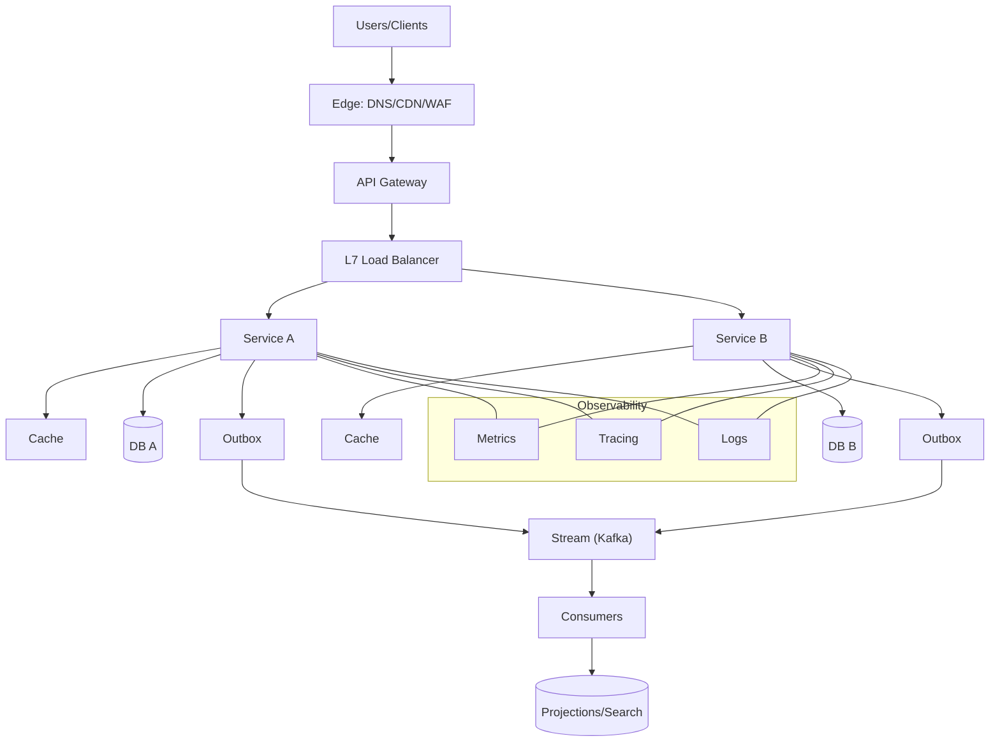

## 1. Interview Approach & Mindset

This playbook helps you drive system design interviews with clarity, structure, and trade-offs. Aim to cover breadth first, then choose 1–2 deep dives.

### Goals
- Communicate clearly, reason with data, and surface trade-offs
- Balance high-level architecture with low-level design details
- Demonstrate reliability, scalability, and operability thinking

### 8-Step Flow (timeboxed)
1. **Clarify use cases and constraints (2–3 min)**
   - Users, workflows, read/write ratio, expected traffic, latency targets
   - Success metrics, SLAs/SLOs, availability targets
   - **Why**: Establishes scope and prevents over-engineering. Ask about user behavior patterns, peak vs average usage, and business priorities.

2. **Back-of-the-envelope capacity (3–5 min)**
   - DAU/MAU, QPS, payload sizes, storage/day, bandwidth, growth
   - **Why**: Quantifies scale to inform technology choices. Shows you think in numbers, not just buzzwords.

3. **API sketch and data model (3–5 min)**
   - Key endpoints or events, request/response, versioning, idempotency
   - Entities, relationships, indexes, hot partitions risk
   - **Why**: Defines the contract and data flow. Critical for understanding access patterns and scaling challenges.

4. **High-level architecture (5–7 min)**
   - Traffic entry (DNS, CDN, WAF), LB, services, caches, DBs, queues/streams
   - **Why**: Shows system thinking and technology awareness. Demonstrates understanding of modern distributed systems.

5. **NFRs and bottlenecks (3–5 min)**
   - Availability, consistency, durability, latency, throughput
   - **Why**: Forces prioritization and trade-off thinking. Shows you understand what matters most for the specific use case.

6. **Deep dive 1 (5–7 min)**
   - E.g., write path: validation → idempotency → storage → async fanout
   - **Why**: Demonstrates depth in one area. Choose based on what's most critical for the system.

7. **Deep dive 2 (5–7 min)**
   - E.g., cache strategy and invalidation; or event processing + DLQ
   - **Why**: Shows breadth across different concerns. Often choose one performance and one reliability aspect.

8. **Operability (2–3 min)**
   - Observability, deployments, rollbacks, incident response, cost
   - **Why**: Shows production thinking. Many candidates skip this, but it's crucial for real systems.

### Talking in Trade-offs
- **Pattern**: "We can choose A or B. A optimizes for X with costs Y; B optimizes for Z with risks W. Given NFRs, I'd start with A, measure, then evolve to B at scale."
- **Why**: Shows you understand there are no perfect solutions, only trade-offs. Demonstrates data-driven decision making.
- **Example**: "For consistency, we could use strong consistency with 2PC, but that adds latency and reduces availability. Given our 99.9% availability target, I'd start with eventual consistency via events, then add strong consistency for critical paths if needed."

### Quick Capacity Estimation Template
- **Peak QPS** = DAU × actions/user/day ÷ seconds/day × peak factor
- **Storage/day** = events/day × avg size × replication
- **Bandwidth** = QPS × payload × 8 bits ÷ compression ratio
- **Cache hit goal** = 80–95% for hot paths; estimate origin load accordingly

**Why this matters**: Shows you can translate business requirements into technical specifications. Interviewers want to see you think quantitatively.

### API and Data Model Template
- **Public API**: resources, verbs, pagination, filtering, idempotency, error format
- **Events**: name, schema/version, key/partitioning strategy
- **Data model**: entities, access patterns, critical indexes, uniqueness guarantees

**Key insight**: Design APIs for the client's needs, not just internal convenience. Consider versioning strategy early.

### Architecture Checklist
- **Entry**: DNS, Anycast, CDN, WAF, API gateway
- **LB**: L4/L7, health checks, connection reuse, TLS termination
- **Services**: sync (REST/gRPC) vs async (events), timeouts, retries, circuit breaker
- **State**: cache tiers, DB choice and scaling, search, analytics
- **Async**: queue/stream, consumer groups, DLQ, replay
- **Consistency**: read/write paths, idempotency, outbox, saga

**Why this order**: Follows the request flow from edge to data. Each layer has specific responsibilities and failure modes.

### Deep Dive Examples
- **Write path**: dedupe/idempotency → validation → DB transaction → outbox → event bus → consumers → projection stores
- **Cache strategy**: cache-aside with stampede protection (locks/jitter/coalescing), hot key mitigation, TTL policy
- **Ordering**: per-entity partitioning, monotonic IDs, sequence tables or Snowflake/ULID

**Pro tip**: Choose deep dives based on what the interviewer seems most interested in. If they ask about performance, dive into caching. If they ask about reliability, dive into failure handling.

### Operability
- **Observability**: RED/USE metrics, logs with correlation IDs, distributed tracing
- **Resilience**: timeouts, retries with jitter, backoff caps, bulkheads, circuit breakers
- **Rollouts**: blue/green, canary, feature flags, schema expand/contract
- **Cost**: storage classes, right-size instances, autoscaling, egress awareness

**Why this matters**: Systems that can't be operated fail in production. Show you understand the operational reality.

### Common Pitfalls
- **No idempotency on write APIs**: Leads to duplicate data and reconciliation nightmares
- **No DLQ**: Failed messages get lost, breaking workflows
- **Missing hot partition analysis**: Causes performance cliffs at scale
- **Over-indexing on tech buzzwords**: Shows lack of understanding
- **Under-specified NFRs**: Leads to designs that don't meet requirements
- **Designs that cannot be operated**: Theoretical systems that fail in practice

**Avoid these**: They're common and show lack of production experience.

### Practice Prompts
- **Rate limiter for multi-tenant APIs**: Focus on distributed counting, tenant isolation, and burst handling
- **News feed with write-optimized fanout**: Emphasize the trade-off between write cost and read performance
- **Chat system with typing indicators and read receipts**: Highlight real-time requirements and state management

**Practice strategy**: Start with these, then move to more complex systems. Focus on the trade-offs and failure modes.

### 60-second Close
- **Restate**: core design, key NFRs, risks, experiments/measurements, and evolution plan
- **Why**: Shows you can synthesize complex information. Demonstrates executive communication skills.

### Reference Diagram (HLD template)

**Use this template**: It covers all the essential components. Customize based on your specific system.

### Sample Talk Track (90 seconds)
- "Users hit CDN/WAF, requests go through an API gateway for auth, quotas, and routing. L7 LB fans into stateless services using gRPC internally. We use cache-aside at the service layer targeting 80–90% hit for hot reads. Each service owns its DB; writes are transactional with an outbox table to publish events to Kafka. Downstream consumers build projections (search/read models). We set timeouts/retries with jitter, circuit breakers, and shed load under stress. Observability via metrics, logs with correlation IDs, and distributed tracing. We'll canary deploy with feature flags and have a rollback path."

**Practice this**: It's a good baseline that covers all the key points. Customize for your specific examples.

### Question Bank (with concise answers)
- **Consistency model**: Per-aggregate strong consistency on writes; cross-aggregate eventual via events and materialized views.
- **Idempotency**: Idempotency keys for public write APIs; dedup store with TTL; consumers dedup by message key/version.
- **Hot partitions**: Choose partition keys with uniformity; add random suffixing for celebrity users; monitor top-K keys.
- **Backpressure**: Bounded queues, priority lanes, admission control; shed non-critical traffic first.
- **Schema changes**: Expand/contract with dual-write, backfill, cutover guarded by flags.

**Memorize these**: They're common questions and show you understand the fundamentals.

### Additional Resources for Deep Study
- **Books**: "Designing Data-Intensive Applications" by Martin Kleppmann (comprehensive coverage)
- **Papers**: "Dynamo: Amazon's Highly Available Key-value Store" (distributed systems fundamentals)
- **Practice**: System Design Primer on GitHub, Grokking the System Design Interview
- **Real-world**: Study how companies like Netflix, Uber, and Twitter handle scale

**Study strategy**: Read the book for fundamentals, practice with exercises, then study real-world architectures to understand practical constraints.

