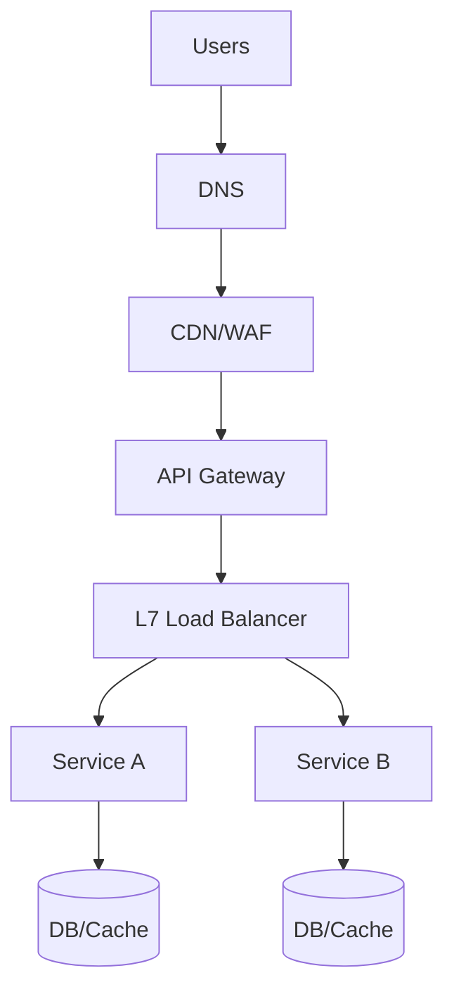

## 3. Networking, Load Balancing, and Rate Limiting

Design reliable entry and traffic management from the edge to services.

### Edge and Transport
- **DNS (weighted/geo), Anycast IPs, CDN for static/media, WAF/DDoS protection**
  - **DNS**: Route users to the closest or least loaded data center
  - **Anycast**: Same IP address in multiple locations, automatically routes to nearest
  - **CDN**: Cache static content closer to users, reducing latency and origin load
  - **WAF**: Web Application Firewall - protects against common web attacks
  - **DDoS protection**: Distributed Denial of Service protection at the edge

- **TLS termination at edge/LB; HTTP/1.1 vs HTTP/2 vs HTTP/3 (QUIC)**
  - **TLS termination**: Decrypt HTTPS at edge, reducing backend load
  - **HTTP/1.1**: One request per connection, head-of-line blocking
  - **HTTP/2**: Multiple requests per connection, server push, header compression
  - **HTTP/3**: Built on QUIC (UDP), eliminates head-of-line blocking, faster connection setup

- **gRPC for service-to-service; REST/HTTP for public; WebSocket/SSE for realtime**
  - **gRPC**: High-performance RPC using HTTP/2, Protocol Buffers, bidirectional streaming
  - **REST/HTTP**: Standard for public APIs, easy to debug and integrate
  - **WebSocket**: Full-duplex communication for real-time updates
  - **SSE**: Server-Sent Events, one-way real-time updates from server to client

**Key insight**: Choose protocols based on use case. gRPC for internal services, REST for public APIs, WebSocket for real-time.

### Load Balancing
- **L4 vs L7: costs, features, stickiness, TLS**
  - **L4 (Transport)**: Works at TCP/UDP level, faster but less intelligent
  - **L7 (Application)**: Works at HTTP level, more features but higher latency
  - **Stickiness**: Route same user to same server (useful for sessions)
  - **TLS**: L7 can terminate TLS, L4 cannot

- **Algorithms: round-robin, least-connections, EWMA latency, consistent hashing**
  - **Round-robin**: Distribute requests evenly across servers
  - **Least-connections**: Route to server with fewest active connections
  - **EWMA**: Exponentially Weighted Moving Average of latency
  - **Consistent hashing**: Stable mapping even when servers are added/removed

- **Health checks: active/passive; outlier detection; slow-start**
  - **Active**: Load balancer sends requests to check server health
  - **Passive**: Monitor actual traffic for health issues
  - **Outlier detection**: Remove servers that are performing poorly
  - **Slow-start**: Gradually increase traffic to newly added servers

- **Connection pooling, keep-alive, head-of-line blocking considerations**
  - **Connection pooling**: Reuse connections instead of creating new ones
  - **Keep-alive**: Keep connections open for multiple requests
  - **Head-of-line blocking**: One slow request blocks others in the same connection

**Why this matters**: Load balancing is the foundation of scalability and reliability. Poor load balancing leads to uneven load distribution and cascading failures.

### Service Discovery
- **DNS-based, Consul/etcd/ZooKeeper, or Kubernetes Service + kube-proxy/IPVS**
  - **DNS**: Simple but limited (no health checks, caching issues)
  - **Consul/etcd**: Distributed key-value stores with service registration
  - **Kubernetes**: Built-in service discovery with automatic health checks
  - **kube-proxy**: Routes traffic to pods, supports multiple modes

- **Sidecars vs mesh control-plane (Istio/Linkerd) for mTLS, retries, circuit breaking**
  - **Sidecars**: Proxy deployed alongside each service
  - **Mesh control-plane**: Centralized control of all sidecars
  - **mTLS**: Mutual TLS for service-to-service authentication
  - **Retries/circuit breaking**: Resilience patterns implemented at the mesh level

**Key insight**: Service discovery is critical for microservices. Choose based on your infrastructure and operational complexity.

### Rate Limiting and Quotas
- **Algorithms: token bucket (burst-friendly), leaky bucket (smoothing), fixed/sliding window**
  - **Token bucket**: Allows bursts up to bucket capacity, refills at constant rate
  - **Leaky bucket**: Smooths traffic by processing at constant rate
  - **Fixed window**: Simple but allows bursts at window boundaries
  - **Sliding window**: More accurate but more complex

- **Scope: per API key, per user, per tenant, per IP; hierarchical quotas**
  - **Per API key**: Different limits for different API keys
  - **Per user**: Different limits for different users
  - **Per tenant**: Different limits for different organizations
  - **Per IP**: Rate limit by source IP address
  - **Hierarchical**: Parent quotas limit child quotas

- **Distributed counters: Redis with Lua, sharded counters, or centralized gateway**
  - **Redis with Lua**: Atomic operations for rate limiting
  - **Sharded counters**: Distribute rate limiting across multiple nodes
  - **Centralized gateway**: Single point of enforcement

- **Retry headers, 429 responses, backoff with jitter**
  - **Retry headers**: Tell clients when they can retry
  - **429 responses**: Standard HTTP response for rate limited requests
  - **Backoff with jitter**: Exponential backoff with random variation to prevent thundering herds

**Why this matters**: Rate limiting protects your system from abuse and ensures fair usage. Poor rate limiting can lead to DoS attacks or unfair resource consumption.

### API Gateway vs Ingress
- **Gateway: authN/Z, quotas, transformations, canary, observability**
  - **AuthN/Z**: Authentication and authorization
  - **Quotas**: Rate limiting and usage tracking
  - **Transformations**: Request/response modification
  - **Canary**: Traffic splitting for testing
  - **Observability**: Logging, metrics, tracing

- **Ingress: L7 routing into cluster; pair with gateway for external concerns**
  - **Ingress**: Routes traffic within Kubernetes cluster
  - **Gateway**: Handles external concerns like authentication and rate limiting

**Key insight**: Use both - Ingress for internal routing, Gateway for external concerns. Don't duplicate functionality.

### Blue/Green and Canary
- **Traffic splitting by header/hash/percentage; baked-in rollback paths**
  - **Header**: Route based on HTTP headers
  - **Hash**: Route based on request hash
  - **Percentage**: Route percentage of traffic to new version
  - **Rollback**: Always have a way to quickly revert to previous version

- **Shadow traffic for validation without user impact**
  - **Shadow**: Send traffic to new version without affecting user experience
  - **Validation**: Compare responses between old and new versions

**Why this matters**: Safe deployments are critical for production systems. Always have a rollback plan.

### Interview Checklist
- **Edge → LB → gateway → services path with TLS and health checks**
  - Show you understand the complete request flow
  - Emphasize security (TLS) and reliability (health checks)
- **Choice of LB algorithm and stickiness; failure scenarios**
  - Explain why you chose a specific algorithm
  - Discuss what happens when load balancers fail
- **Rate limiting strategy and implementation detail (where and how)**
  - Where: Edge, gateway, or service level
  - How: Algorithm choice and implementation details

### Reference Diagram (Edge → Services)


**Use this template**: It shows the complete flow from users to services. Customize based on your specific architecture.

### Token Bucket (conceptual)
```java
record Bucket(long capacity, double refillPerSec, double tokens, long lastTsMs) {}
// For distributed enforcement use Redis Lua to do: refill → check → decrement atomically per key.
```

**Key insight**: Token bucket is often the best choice for rate limiting because it allows bursts while maintaining long-term rate limits.

### Stickiness vs Consistent Hashing
- **Stickiness**: reduces TLS/session setup; risks imbalance if slow nodes
  - **Pros**: Better performance for stateful applications
  - **Cons**: Can lead to uneven load distribution
- **Consistent hashing**: stable key→node mapping for caches; needs ring rebalancing
  - **Pros**: Even distribution, stable mapping
  - **Cons**: More complex, requires rebalancing when nodes change

**Choose based on**: Whether you need session affinity or even load distribution.

### Failure Modes
- **LB node failure** → health checks + outlier ejection
  - **Health checks**: Detect failed load balancers
  - **Outlier ejection**: Remove failed nodes from rotation
- **Gateway overload** → shed non-critical, enforce per-tenant limits
  - **Shedding**: Drop non-critical requests under load
  - **Per-tenant limits**: Ensure fair resource allocation
- **TLS issues** → automated cert rotation, OCSP stapling
  - **Cert rotation**: Automatically renew certificates
  - **OCSP stapling**: Reduce certificate validation overhead

**Key insight**: Plan for failures at every layer. Load balancers and gateways are single points of failure.

### Additional Resources for Deep Study
- **Books**: "High Performance Browser Networking" by Ilya Grigorik (HTTP/2, QUIC)
- **Papers**: "The Tail at Scale" by Dean and Barroso (load balancing and tail latency)
- **Practice**: Set up a simple load balancer with HAProxy or nginx
- **Real-world**: Study how companies like Netflix and Google handle edge traffic

**Study strategy**: Understand the protocols, practice with tools, then study real-world implementations to understand practical constraints.


