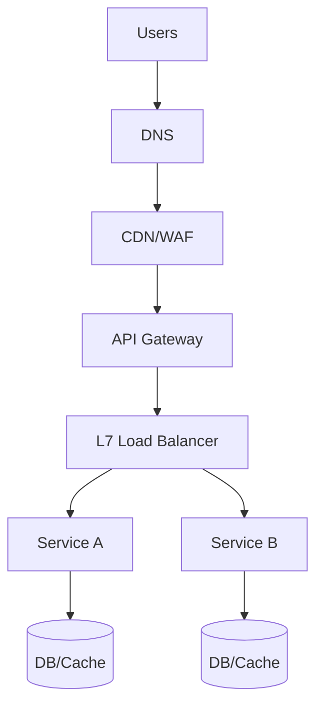

## 3. Networking, Load Balancing, and Rate Limiting

Design reliable entry and traffic management from the edge to services.

### Edge and Transport
- DNS (weighted/geo), Anycast IPs, CDN for static/media, WAF/DDoS protection
- TLS termination at edge/LB; HTTP/1.1 vs HTTP/2 vs HTTP/3 (QUIC)
- gRPC for service-to-service; REST/HTTP for public; WebSocket/SSE for realtime

### Load Balancing
- L4 vs L7: costs, features, stickiness, TLS
- Algorithms: round-robin, least-connections, EWMA latency, consistent hashing
- Health checks: active/passive; outlier detection; slow-start
- Connection pooling, keep-alive, head-of-line blocking considerations

### Service Discovery
- DNS-based, Consul/etcd/ZooKeeper, or Kubernetes Service + kube-proxy/IPVS
- Sidecars vs mesh control-plane (Istio/Linkerd) for mTLS, retries, circuit breaking

### Rate Limiting and Quotas
- Algorithms: token bucket (burst-friendly), leaky bucket (smoothing), fixed/sliding window
- Scope: per API key, per user, per tenant, per IP; hierarchical quotas
- Distributed counters: Redis with Lua, sharded counters, or centralized gateway
- Retry headers, 429 responses, backoff with jitter

### API Gateway vs Ingress
- Gateway: authN/Z, quotas, transformations, canary, observability
- Ingress: L7 routing into cluster; pair with gateway for external concerns

### Blue/Green and Canary
- Traffic splitting by header/hash/percentage; baked-in rollback paths
- Shadow traffic for validation without user impact

### Interview Checklist
- Edge → LB → gateway → services path with TLS and health checks
- Choice of LB algorithm and stickiness; failure scenarios
- Rate limiting strategy and implementation detail (where and how)


### Reference Diagram (Edge → Services)


### Token Bucket (conceptual)
```java
record Bucket(long capacity, double refillPerSec, double tokens, long lastTsMs) {}
// For distributed enforcement use Redis Lua to do: refill → check → decrement atomically per key.
```

### Stickiness vs Consistent Hashing
- **Stickiness**: reduces TLS/session setup; risks imbalance if slow nodes
- **Consistent hashing**: stable key→node mapping for caches; needs ring rebalancing

### Failure Modes
- LB node failure → health checks + outlier ejection
- Gateway overload → shed non-critical, enforce per-tenant limits
- TLS issues → automated cert rotation, OCSP stapling


