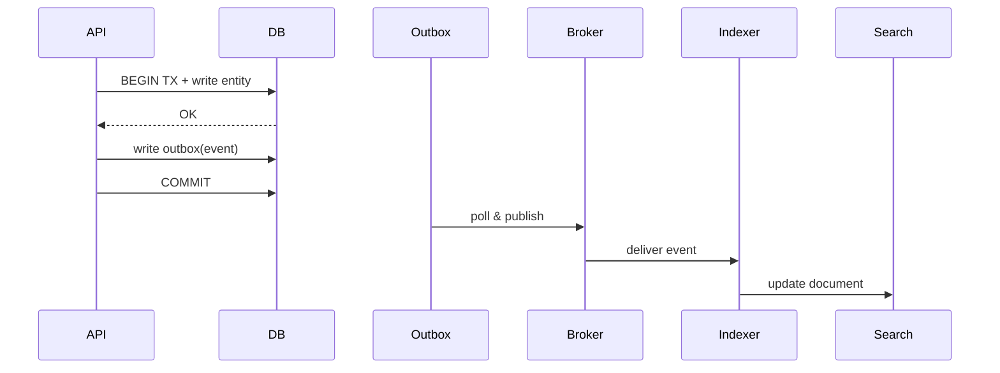

## 4. Storage, Indexing, and Search

Choose storage by access patterns, consistency, and scale.

### Datastore Options
- **Relational (PostgreSQL/MySQL): transactions, joins, strong consistency**
  - **What it is**: Traditional SQL databases with ACID properties
  - **When to use**: When you need transactions, complex queries, or strong consistency
  - **Pros**: ACID compliance, rich query language, mature ecosystem
  - **Cons**: Harder to scale horizontally, single point of failure
  - **Example use cases**: User accounts, financial transactions, complex reporting

- **Key-Value/Document (Redis, DynamoDB, MongoDB): flexible schema, partition scaling**
  - **What it is**: Simple key-value storage or document storage
  - **When to use**: When you need high throughput, simple queries, or flexible schemas
  - **Pros**: High performance, easy to scale, flexible schemas
  - **Cons**: Limited query capabilities, eventual consistency
  - **Example use cases**: Caching, user sessions, simple data storage

- **Wide-Column (Cassandra/Scylla): time-series, write-heavy, tunable consistency**
  - **What it is**: Column-family databases optimized for write-heavy workloads
  - **When to use**: When you have high write throughput or time-series data
  - **Pros**: High write throughput, linear scalability, tunable consistency
  - **Cons**: Complex data modeling, limited query flexibility
  - **Example use cases**: IoT data, metrics, event logs

- **Search (Elasticsearch/OpenSearch): full-text, aggregations, scoring**
  - **What it is**: Specialized databases for search and analytics
  - **When to use**: When you need full-text search, complex aggregations, or relevance scoring
  - **Pros**: Powerful search capabilities, rich analytics, horizontal scaling
  - **Cons**: Complex to operate, eventual consistency, resource intensive
  - **Example use cases**: Product search, log analysis, content discovery

- **Analytics/Lake (BigQuery/Snowflake/S3+Athena): OLAP, columnar, separation of storage/compute**
  - **What it is**: Data warehouses optimized for analytical queries
  - **When to use**: When you need complex analytics, reporting, or data exploration
  - **Pros**: Excellent for analytics, cost-effective for large datasets, separation of storage/compute
  - **Cons**: Not suitable for transactional workloads, eventual consistency
  - **Example use cases**: Business intelligence, data science, reporting

**Key insight**: Choose based on your primary access patterns. Don't try to make one database do everything.

### Indexing
- **B-Tree vs Hash; covering/composite indexes; partial/filtered indexes**
  - **B-Tree**: Balanced tree structure, good for range queries and sorting
  - **Hash**: Direct key lookup, fastest for exact matches but no range queries
  - **Covering**: Index contains all columns needed for the query
  - **Composite**: Multiple columns in one index
  - **Partial**: Only index rows that meet certain conditions

- **Write amplification vs read speed; avoid over-indexing hot write tables**
  - **Write amplification**: Each write may update multiple indexes
  - **Read speed**: More indexes = faster reads but slower writes
  - **Hot write tables**: Tables with high write volume should have minimal indexes

- **Secondary index consistency and backfill strategies**
  - **Consistency**: Secondary indexes may be eventually consistent
  - **Backfill**: Strategies for building indexes on existing data
  - **Example**: Create index concurrently, use background jobs

**Why this matters**: Poor indexing leads to slow queries and poor user experience. Good indexing is critical for performance.

### Transactions and Isolation
- **ACID; MVCC; isolation levels: RC, RR, Serializable**
  - **ACID**: Atomicity, Consistency, Isolation, Durability
  - **MVCC**: Multi-Version Concurrency Control - readers don't block writers
  - **RC (Read Committed)**: See only committed changes, no dirty reads
  - **RR (Repeatable Read)**: Consistent snapshot throughout transaction
  - **Serializable**: Highest isolation, prevents all concurrency anomalies

- **Idempotent writes; unique constraints; application-level de-dup keys**
  - **Idempotent**: Same operation multiple times has same effect
  - **Unique constraints**: Database-level enforcement of uniqueness
  - **De-dup keys**: Application-level deduplication using unique identifiers

**Key insight**: Choose isolation level based on your consistency requirements. Higher isolation = better consistency but lower concurrency.

### Scaling Patterns
- **Read replicas; read-your-writes via session stickiness or read-after-write delay**
  - **Read replicas**: Distribute read load across multiple databases
  - **Read-your-writes**: Ensure users see their own writes immediately
  - **Session stickiness**: Route same user to same replica
  - **Read-after-write delay**: Wait before reading from replicas

- **Sharding: range vs hash vs directory; rebalancing; consistent hashing**
  - **Range**: Partition by value ranges (e.g., user ID ranges)
  - **Hash**: Partition by hash of key (e.g., hash of user ID)
  - **Directory**: Lookup table for key-to-shard mapping
  - **Rebalancing**: Moving data between shards as they grow
  - **Consistent hashing**: Minimize data movement during rebalancing

- **Multi-region: leader/follower, active-active with conflict resolution**
  - **Leader/follower**: One region handles writes, others replicate
  - **Active-active**: Multiple regions handle writes, resolve conflicts
  - **Conflict resolution**: Strategies for handling concurrent updates

**Why this matters**: Scaling databases is one of the hardest problems in distributed systems. Plan your scaling strategy early.

### Migrations and Schema Evolution
- **Expand/contract: backward-compatible first; dual-write; data backfill; cutover**
  - **Expand**: Add new columns/features while maintaining backward compatibility
  - **Contract**: Remove old columns/features after migration
  - **Dual-write**: Write to both old and new schemas during transition
  - **Data backfill**: Migrate existing data to new schema
  - **Cutover**: Switch to new schema completely

- **Online migrations: pt-online-schema-change, gh-ost; feature flags for new paths**
  - **Online**: Migrate schema without downtime
  - **pt-online-schema-change**: Percona tool for MySQL
  - **gh-ost**: GitHub's online schema migration tool
  - **Feature flags**: Control which code path uses new schema

**Key insight**: Schema changes are inevitable. Plan for them from the beginning.

### Search Integration
- **Dual-write to DB + search via outbox → consumer → index**
  - **Dual-write**: Write to both database and search index
  - **Outbox**: Reliable event publishing pattern
  - **Consumer**: Process events and update search index
  - **Index**: Search index (Elasticsearch, etc.)

- **Re-index pipelines; zero-downtime reindex via alias swap**
  - **Re-index**: Rebuild search index from scratch
  - **Alias swap**: Switch between old and new indexes without downtime

**Why this matters**: Search is often a critical user experience feature. Plan for search from the beginning.

### Interview Checklist
- **Data model + critical indexes for access paths**
  - Show your data model and explain your indexing strategy
  - Focus on the most common access patterns
- **Chosen datastore with scaling plan; shard/partition keys and hotspot mitigation**
  - Explain why you chose a specific datastore
  - Show you understand scaling challenges
- **Migration and reindex strategy; consistency model and failure modes**
  - Demonstrate operational thinking
  - Show you understand real-world constraints

### Selection Guide (quick)
- **OLTP with strong invariants** → PostgreSQL/MySQL (read replicas, partitioning)
- **Write-heavy time-series** → Cassandra/Scylla (LSM, tunable consistency)
- **Document with flexible queries** → MongoDB (schema-on-read)
- **Key-value hot paths** → Redis (LRU/LFU, TTL)
- **Full-text and analytics over text** → Elasticsearch/OpenSearch
- **Cheap large blobs/analytics** → S3 + Glue/Athena/BigQuery

**Use this guide**: It's a good starting point for choosing the right database.

### Write Path with Outbox and Search Index


**Key insight**: The outbox pattern ensures reliable event publishing even when external systems are down.

### Example Tables (simplified)
```sql
CREATE TABLE post(
  id BIGSERIAL PRIMARY KEY,
  user_id BIGINT NOT NULL,
  body TEXT,
  created_at TIMESTAMPTZ NOT NULL DEFAULT now()
);
CREATE INDEX ix_post_user_time ON post(user_id, created_at DESC);

CREATE TABLE outbox(
  id BIGSERIAL PRIMARY KEY,
  aggregate_id BIGINT,
  type TEXT,
  payload JSONB,
  created_at TIMESTAMPTZ DEFAULT now(),
  published BOOLEAN DEFAULT FALSE
);
```

**Study this**: It shows a simple but effective pattern for reliable event publishing.

### Additional Resources for Deep Study
- **Books**: "Designing Data-Intensive Applications" by Martin Kleppmann (comprehensive coverage)
- **Papers**: "Dynamo: Amazon's Highly Available Key-value Store" (distributed databases)
- **Practice**: Set up different databases and benchmark them
- **Real-world**: Study how companies like Netflix, Uber, and Twitter handle data

**Study strategy**: Understand the fundamentals, practice with real databases, then study real-world architectures to understand practical constraints.


