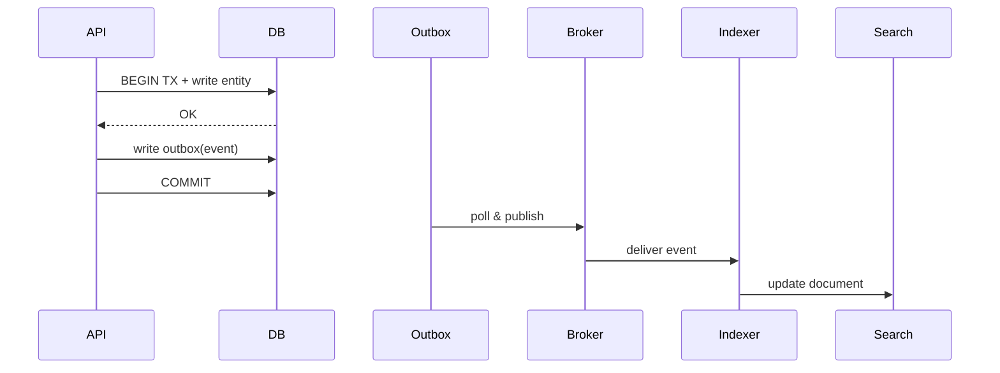

## 4. Storage, Indexing, and Search

Choose storage by access patterns, consistency, and scale.

### Datastore Options
- Relational (PostgreSQL/MySQL): transactions, joins, strong consistency
- Key-Value/Document (Redis, DynamoDB, MongoDB): flexible schema, partition scaling
- Wide-Column (Cassandra/Scylla): time-series, write-heavy, tunable consistency
- Search (Elasticsearch/OpenSearch): full-text, aggregations, scoring
- Analytics/Lake (BigQuery/Snowflake/S3+Athena): OLAP, columnar, separation of storage/compute

### Indexing
- B-Tree vs Hash; covering/composite indexes; partial/filtered indexes
- Write amplification vs read speed; avoid over-indexing hot write tables
- Secondary index consistency and backfill strategies

### Transactions and Isolation
- ACID; MVCC; isolation levels: RC, RR, Serializable
- Idempotent writes; unique constraints; application-level de-dup keys

### Scaling Patterns
- Read replicas; read-your-writes via session stickiness or read-after-write delay
- Sharding: range vs hash vs directory; rebalancing; consistent hashing
- Multi-region: leader/follower, active-active with conflict resolution

### Migrations and Schema Evolution
- Expand/contract: backward-compatible first; dual-write; data backfill; cutover
- Online migrations: pt-online-schema-change, gh-ost; feature flags for new paths

### Search Integration
- Dual-write to DB + search via outbox → consumer → index
- Re-index pipelines; zero-downtime reindex via alias swap

### Interview Checklist
- Data model + critical indexes for access paths
- Chosen datastore with scaling plan; shard/partition keys and hotspot mitigation
- Migration and reindex strategy; consistency model and failure modes


### Selection Guide (quick)
- OLTP with strong invariants → PostgreSQL/MySQL (read replicas, partitioning)
- Write-heavy time-series → Cassandra/Scylla (LSM, tunable consistency)
- Document with flexible queries → MongoDB (schema-on-read)
- Key-value hot paths → Redis (LRU/LFU, TTL)
- Full-text and analytics over text → Elasticsearch/OpenSearch
- Cheap large blobs/analytics → S3 + Glue/Athena/BigQuery

### Write Path with Outbox and Search Index


### Example Tables (simplified)
```sql
CREATE TABLE post(
  id BIGSERIAL PRIMARY KEY,
  user_id BIGINT NOT NULL,
  body TEXT,
  created_at TIMESTAMPTZ NOT NULL DEFAULT now()
);
CREATE INDEX ix_post_user_time ON post(user_id, created_at DESC);

CREATE TABLE outbox(
  id BIGSERIAL PRIMARY KEY,
  aggregate_id BIGINT,
  type TEXT,
  payload JSONB,
  created_at TIMESTAMPTZ DEFAULT now(),
  published BOOLEAN DEFAULT FALSE
);
```


