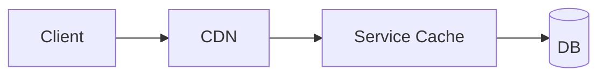

## 5. Caching and CDNs

Caches reduce latency and origin load; CDNs bring content closer to users.

### Cache Placement
- **Client/App cache → CDN/Edge → Service cache → DB page/cache**
  - **Client cache**: Browser cache, mobile app cache
  - **CDN/Edge**: Content Delivery Network, edge locations
  - **Service cache**: Application-level caching (Redis, Memcached)
  - **DB cache**: Database query cache, buffer pool

**Key insight**: Each layer serves different purposes. Client cache improves user experience, CDN reduces bandwidth costs, service cache improves performance, DB cache reduces disk I/O.

### Strategies
- **Cache-aside (lazy): application loads on miss; simplest, popular**
  - **What it is**: Application checks cache first, loads from source on miss
  - **When to use**: Most common pattern, good for read-heavy workloads
  - **Pros**: Simple to implement, flexible
  - **Cons**: Cache miss latency, potential for stale data
  - **Example**: User profile data, product information

- **Write-through: low miss, higher write latency**
  - **What it is**: Write to both cache and source simultaneously
  - **When to use**: When you need low cache miss rates
  - **Pros**: Consistent data, low miss rates
  - **Cons**: Higher write latency, more complex
  - **Example**: Configuration data, reference data

- **Write-behind: buffer writes; risk of loss; requires durable queues**
  - **What it is**: Write to cache first, then to source asynchronously
  - **When to use**: When write performance is critical
  - **Pros**: Fast writes, good for write-heavy workloads
  - **Cons**: Risk of data loss, eventual consistency
  - **Example**: Analytics data, non-critical user actions

**Choose based on**: Your consistency requirements vs performance needs.

### Invalidation and Freshness
- **TTL/TTI; soft TTL with background refresh; stale-while-revalidate**
  - **TTL**: Time To Live - how long data stays in cache
  - **TTI**: Time To Idle - how long data stays after last access
  - **Soft TTL**: Refresh data in background before expiration
  - **Stale-while-revalidate**: Serve stale data while refreshing in background

- **Stampede protection: mutex, request coalescing, jittered TTLs**
  - **Stampede**: Multiple requests for same data when cache expires
  - **Mutex**: Only one request refreshes data, others wait
  - **Request coalescing**: Combine multiple requests for same data
  - **Jittered TTLs**: Add random variation to prevent synchronized expiration

- **Versioned keys; generational caching for bulk invalidation**
  - **Versioned keys**: Include version in cache key for easy invalidation
  - **Generational caching**: Use generation numbers for bulk operations
  - **Example**: `user:123:v2` instead of just `user:123`

**Why this matters**: Poor cache invalidation leads to stale data and poor user experience. Good invalidation strategies are critical for cache effectiveness.

### Hot Key Mitigation
- **Per-key sharding with suffixing; selective bypass; local LRU tiers**
  - **Per-key sharding**: Distribute hot keys across multiple cache nodes
  - **Suffixing**: Add random suffix to distribute load
  - **Selective bypass**: Skip cache for extremely hot keys
  - **Local LRU tiers**: Multiple cache layers with different eviction policies

- **Pre-warm on deploy; partial response caching**
  - **Pre-warm**: Load expected data into cache before it's needed
  - **Partial response caching**: Cache parts of responses that don't change

**Key insight**: Hot keys can cause performance cliffs. Plan for them from the beginning.

### CDN
- **Cache-control headers; origin shielding; signed URLs; range requests**
  - **Cache-control**: HTTP headers that control caching behavior
  - **Origin shielding**: CDN protects origin from direct traffic
  - **Signed URLs**: Time-limited URLs for private content
  - **Range requests**: Support for partial content requests (video streaming)

- **Image/video transforms at edge; device-aware variants**
  - **Edge transforms**: Resize images, convert formats at CDN edge
  - **Device-aware**: Serve different content based on device capabilities
  - **Example**: Different image sizes for mobile vs desktop

**Why this matters**: CDNs can dramatically improve performance and reduce costs. Use them for all static content.

### Interview Checklist
- **Placement, strategy, invalidation; stampede and hot key handling**
  - Explain where you place caches and why
  - Show you understand cache invalidation challenges
- **Cache key design (avoid unbounded cardinality); approximate sizing and hit goal**
  - Demonstrate good cache key design
  - Show you can estimate cache requirements
- **CDN behavior and origin protection**
  - Explain how CDN integrates with your system
  - Show you understand CDN limitations

### Multi-tier Caching Diagram


**Use this template**: It shows the complete caching hierarchy. Customize based on your specific needs.

### Stampede Guard (concept)
```java
// On miss, acquire short lock in Redis; one filler populates, others wait or serve stale
```

**Key insight**: Stampede protection is critical for production systems. Without it, cache misses can cascade and overwhelm your system.

### CDN Cheat Sheet
- **Set Cache-Control, ETag/If-None-Match**: Control caching behavior
- **Vary by device/lang only if necessary**: Avoid unnecessary cache fragmentation
- **Signed URLs for private media**: Secure access to private content
- **Range requests for video**: Support streaming and partial downloads
- **Origin shield**: Protect your origin from direct traffic

**Best practices**: These are proven patterns that work in production.

### Cache Sizing and Hit Rates
- **Size estimation**: Estimate based on working set size
  - **Working set**: Data that's accessed frequently
  - **Example**: If 20% of users generate 80% of traffic, cache the top 20%
- **Hit rate targets**: 80-95% for most use cases
  - **80%**: Good for most applications
  - **90%**: Excellent, requires careful tuning
  - **95%**: Exceptional, often over-engineered
- **Memory vs disk**: Choose based on performance requirements
  - **Memory**: Fastest, most expensive
  - **Disk**: Slower, cheaper, larger capacity

**Why this matters**: Proper sizing ensures good performance without wasting resources.

### Cache Consistency Patterns
- **Write-through**: Immediate consistency, higher latency
- **Write-behind**: Eventual consistency, lower latency
- **Cache invalidation**: Invalidate cache when data changes
- **Time-based expiration**: Simple but can lead to stale data
- **Version-based**: More complex but provides better consistency

**Choose based on**: Your consistency requirements and performance needs.

### Additional Resources for Deep Study
- **Books**: "High Performance MySQL" by Baron Schwartz (database caching)
- **Papers**: "Scaling Memcache at Facebook" (distributed caching at scale)
- **Practice**: Set up Redis and experiment with different caching patterns
- **Real-world**: Study how companies like Netflix and Amazon use CDNs

**Study strategy**: Understand the fundamentals, practice with real tools, then study real-world implementations to understand practical constraints.


