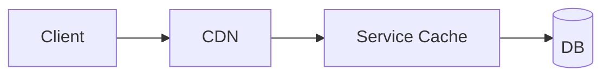

## 5. Caching and CDNs

Caches reduce latency and origin load; CDNs bring content closer to users.

### Cache Placement
- Client/App cache → CDN/Edge → Service cache → DB page/cache

### Strategies
- Cache-aside (lazy): application loads on miss; simplest, popular
- Write-through: low miss, higher write latency
- Write-behind: buffer writes; risk of loss; requires durable queues

### Invalidation and Freshness
- TTL/TTI; soft TTL with background refresh; stale-while-revalidate
- Stampede protection: mutex, request coalescing, jittered TTLs
- Versioned keys; generational caching for bulk invalidation

### Hot Key Mitigation
- Per-key sharding with suffixing; selective bypass; local LRU tiers
- Pre-warm on deploy; partial response caching

### CDN
- Cache-control headers; origin shielding; signed URLs; range requests
- Image/video transforms at edge; device-aware variants

### Interview Checklist
- Placement, strategy, invalidation; stampede and hot key handling
- Cache key design (avoid unbounded cardinality); approximate sizing and hit goal
- CDN behavior and origin protection


### Multi-tier Caching Diagram


### Stampede Guard (concept)
```java
// On miss, acquire short lock in Redis; one filler populates, others wait or serve stale
```

### CDN Cheat Sheet
- Set Cache-Control, ETag/If-None-Match; vary by device/lang only if necessary
- Signed URLs for private media; range requests for video; origin shield


