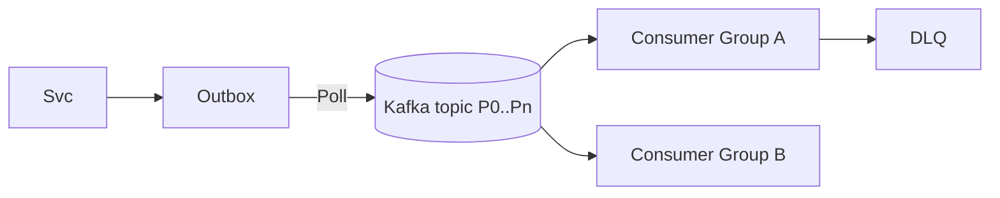

## 6. Queues, Streams, and Event-Driven Systems

Use async to decouple producers and consumers, absorb bursts, and enable workflows.

### Queues vs Streams
- Queue (SQS/RabbitMQ): at-least-once, per-message ack, typical FIFO or best-effort order
- Stream (Kafka/Pulsar): append-only log, partitions, consumer groups, replayable

### Ordering and Idempotency
- Partition by entity for per-key order; avoid cross-key global order expectations
- Idempotent consumers: dedup tables, idempotency keys, exactly-once semantics via transactions/outbox

### Backpressure and DLQ
- Max in-flight, visibility timeouts, retry policies with caps and jitter
- DLQ with triage tooling; poison-pill detection; replay windows

### Processing
- CEP/stream processing: Kafka Streams, Flink; windowing, joins; state stores
- CDC: Debezium to stream DB changes; outbox pattern for reliable publish

### Interview Checklist
- Topic/queue design (partitions, keys); consumer scaling plan
- Failure handling: retries, DLQ, replay, idempotency
- Schema evolution and versioning (Avro/Protobuf + registry)

### Reference Flow (Outbox → Stream → Consumers)

### Exactly-Once Notes
- Achieve practical exactly-once effects via: idempotent producer + transactional writes to outbox, and idempotent consumers with dedup tables.
- Avoid two-phase commit; rely on outbox and retries with idempotency keys.

### Partitioning Example
- Key by `userId` or `aggregateId` to keep per-entity order; choose number of partitions for 1–3 years of growth and consumer parallelism.

