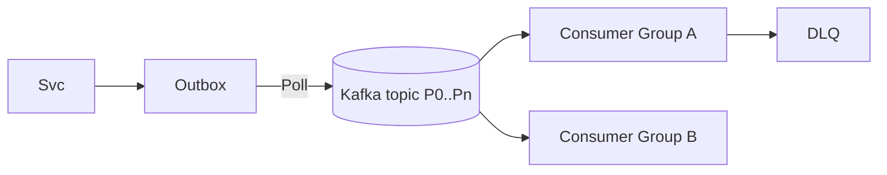

## 6. Queues, Streams, and Event-Driven Systems

Use async to decouple producers and consumers, absorb bursts, and enable workflows.

### Queues vs Streams
- **Queue (SQS/RabbitMQ): at-least-once, per-message ack, typical FIFO or best-effort order**
  - **What it is**: Message broker that stores messages until consumed
  - **When to use**: When you need reliable message delivery and simple processing
  - **Pros**: Simple to use, reliable delivery, good for task queues
  - **Cons**: Limited replay capability, message ordering challenges
  - **Example use cases**: Background jobs, email notifications, task processing

- **Stream (Kafka/Pulsar): append-only log, partitions, consumer groups, replayable**
  - **What it is**: Distributed commit log that stores all messages
  - **When to use**: When you need high throughput, replay capability, or multiple consumers
  - **Pros**: High throughput, replay capability, multiple consumer groups
  - **Cons**: More complex, requires careful partition design
  - **Example use cases**: Event sourcing, data pipelines, real-time analytics

**Key insight**: Use queues for simple task processing, streams for complex event processing and data pipelines.

### Ordering and Idempotency
- **Partition by entity for per-key order; avoid cross-key global order expectations**
  - **Per-key ordering**: Messages with same key are processed in order
  - **Cross-key ordering**: Don't expect global ordering across different keys
  - **Example**: User events are ordered per user, but not across all users

- **Idempotent consumers: dedup tables, idempotency keys, exactly-once semantics via transactions/outbox**
  - **Dedup tables**: Store processed message IDs to avoid duplicates
  - **Idempotency keys**: Use unique keys to identify operations
  - **Exactly-once**: Achieve via idempotent operations and deduplication
  - **Example**: Payment processing where duplicate charges are unacceptable

**Why this matters**: Message ordering and idempotency are critical for data consistency. Poor handling leads to data corruption and business logic errors.

### Backpressure and DLQ
- **Max in-flight, visibility timeouts, retry policies with caps and jitter**
  - **Max in-flight**: Limit number of messages being processed simultaneously
  - **Visibility timeout**: How long message is invisible after being received
  - **Retry policies**: How to handle failed message processing
  - **Caps and jitter**: Limit retries and add randomness to prevent thundering herds

- **DLQ with triage tooling; poison-pill detection; replay windows**
  - **DLQ**: Dead Letter Queue for messages that can't be processed
  - **Triage tooling**: Tools to investigate and fix DLQ messages
  - **Poison-pill detection**: Identify messages that always fail
  - **Replay windows**: Time windows for replaying failed messages

**Key insight**: Backpressure prevents system overload, DLQ prevents message loss. Both are critical for production systems.

### Processing
- **CEP/stream processing: Kafka Streams, Flink; windowing, joins; state stores**
  - **CEP**: Complex Event Processing for real-time analytics
  - **Windowing**: Process data in time windows (tumbling, sliding, session)
  - **Joins**: Combine data from multiple streams
  - **State stores**: Maintain state across message processing

- **CDC: Debezium to stream DB changes; outbox pattern for reliable publish**
  - **CDC**: Change Data Capture - stream database changes
  - **Debezium**: Open-source CDC platform
  - **Outbox pattern**: Reliable event publishing using database transactions

**Why this matters**: Stream processing enables real-time analytics and complex workflows. CDC enables real-time data synchronization.

### Interview Checklist
- **Topic/queue design (partitions, keys); consumer scaling plan**
  - Explain your partitioning strategy and why you chose it
  - Show you understand consumer scaling challenges
- **Failure handling: retries, DLQ, replay, idempotency**
  - Demonstrate understanding of failure scenarios
  - Show you have a plan for handling failures
- **Schema evolution and versioning (Avro/Protobuf + registry)**
  - Explain how you handle schema changes
  - Show you understand the importance of schema management

### Reference Flow (Outbox → Stream → Consumers)

**Use this template**: It shows the complete flow from service to consumers. Customize based on your specific needs.

### Exactly-Once Notes
- **Achieve practical exactly-once effects via**: idempotent producer + transactional writes to outbox, and idempotent consumers with dedup tables.
- **Avoid two-phase commit**: Rely on outbox and retries with idempotency keys.

**Key insight**: True exactly-once is impossible in distributed systems, but you can achieve practical exactly-once effects with proper design.

### Partitioning Example
- **Key by `userId` or `aggregateId`** to keep per-entity order
- **Choose number of partitions** for 1–3 years of growth and consumer parallelism
- **Example**: 100 partitions for 100 consumers, allowing one consumer per partition

**Why this matters**: Good partitioning enables horizontal scaling and maintains message ordering where needed.

### Message Ordering Strategies
- **Single partition**: All messages in order, but limited parallelism
- **Key-based partitioning**: Per-key ordering with parallelism
- **Time-based ordering**: Order by timestamp, not message order
- **Sequence numbers**: Add sequence numbers for ordering

**Choose based on**: Your ordering requirements vs performance needs.

### Consumer Scaling Patterns
- **One consumer per partition**: Maximum parallelism, maintains ordering
- **Multiple consumers per partition**: Higher throughput, no ordering guarantee
- **Consumer groups**: Logical grouping of consumers
- **Rebalancing**: Automatic redistribution of partitions across consumers

**Key insight**: Consumer scaling is limited by partition count. Plan partitions for future growth.

### Failure Handling Patterns
- **Retry with exponential backoff**: Handle transient failures
- **Circuit breaker**: Stop processing when downstream is failing
- **Dead letter queue**: Store failed messages for investigation
- **Poison pill detection**: Identify messages that always fail
- **Replay mechanisms**: Replay failed messages after fixing issues

**Why this matters**: Message processing systems must be resilient to failures. Poor failure handling leads to message loss and system instability.

### Schema Evolution Strategies
- **Backward compatibility**: New schemas can read old data
- **Forward compatibility**: Old schemas can read new data
- **Schema registry**: Centralized schema management
- **Versioning**: Explicit schema versions for compatibility

**Key insight**: Schema evolution is inevitable. Plan for it from the beginning.

### Additional Resources for Deep Study
- **Books**: "Kafka: The Definitive Guide" by Neha Narkhede (Kafka fundamentals)
- **Papers**: "Kafka: A Distributed Messaging System for Log Processing" (Kafka design)
- **Practice**: Set up Kafka and build simple stream processing applications
- **Real-world**: Study how companies like Uber and Netflix use event streaming

**Study strategy**: Understand the fundamentals, practice with real tools, then study real-world implementations to understand practical constraints.

