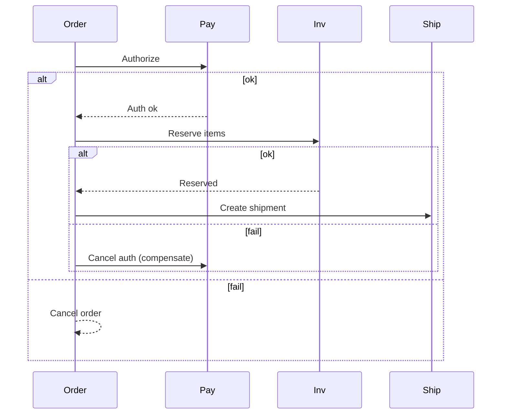

## 7. Microservices Architecture

Design for independent deployability, bounded contexts, and clear contracts.

### Service Boundaries
- Domain-Driven Design (DDD): bounded contexts, Aggregates, domain events
- Avoid entity splitting across services without clear ownership and contracts

### Communication
- Sync: REST/gRPC with strict timeouts, retries with jitter, circuit breakers
- Async: event choreography for decoupling; fanout, projections, audit trails
- API gateway for public; service mesh for internal (mTLS, policy, telemetry)

### Data Ownership and Consistency
- Each service owns its DB; expose data via APIs or events
- Transaction patterns: Saga (orchestrated vs choreographed), Outbox, TCC
- Read models: materialized views; eventual consistency acknowledgements to clients

### Contracts and Evolution
- OpenAPI/Protobuf contracts; backward compatibility; consumer-driven contract tests
- Schema versioning; expand/contract; dual-run and compare

### Operability
- Golden signals; tracing with correlation IDs; structured logs
- Rollouts: canary; feature flags; database migration gates

### Anti-Patterns
- Shared DB across services; tight coupling through data or synchronous chains
- Over-microservicing before clear scale/organizational need

### Interview Checklist
- Clear boundaries, contracts, and data ownership
- Consistency strategy (saga/outbox), idempotency, and failure handling
- Operability and evolution plan

### Decomposition Example (E-commerce)
- Catalog, Inventory, Orders, Payments, Shipping, Notifications
- Ownership: Orders owns order state; Payments owns charges/refunds; events share updates

### Saga Orchestrator (Order → Payment → Inventory → Shipping)

### Contract Evolution
- Additive changes first; reserve fields/IDs; consumer-driven contract tests to prevent breaking downstreams.

