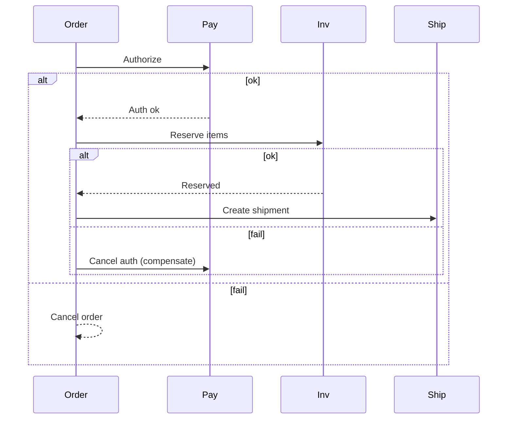

## 7. Microservices Architecture

Design for independent deployability, bounded contexts, and clear contracts.

### Service Boundaries
- **Domain-Driven Design (DDD): bounded contexts, Aggregates, domain events**
  - **Bounded contexts**: Clear boundaries between different business domains
  - **Aggregates**: Clusters of related entities that are treated as a unit
  - **Domain events**: Events that occur within a domain
  - **Example**: User management, order processing, payment processing as separate contexts

- **Avoid entity splitting across services without clear ownership and contracts**
  - **Entity splitting**: Dividing a single business entity across multiple services
  - **Clear ownership**: Each service owns its data completely
  - **Contracts**: Well-defined APIs between services
  - **Anti-pattern**: User data split between auth service and profile service

**Key insight**: Service boundaries should align with business domains, not technical concerns. Clear boundaries enable independent development and deployment.

### Communication
- **Sync: REST/gRPC with strict timeouts, retries with jitter, circuit breakers**
  - **REST**: Simple HTTP-based communication, good for public APIs
  - **gRPC**: High-performance RPC, good for internal service communication
  - **Timeouts**: Prevent services from waiting indefinitely
  - **Retries with jitter**: Handle transient failures without overwhelming downstream
  - **Circuit breakers**: Stop calling failing services to prevent cascading failures

- **Async: event choreography for decoupling; fanout, projections, audit trails**
  - **Event choreography**: Services communicate via events without central coordination
  - **Fanout**: One event triggers multiple downstream actions
  - **Projections**: Read-optimized views built from events
  - **Audit trails**: Complete history of all system changes

- **API gateway for public; service mesh for internal (mTLS, policy, telemetry)**
  - **API gateway**: Single entry point for external clients
  - **Service mesh**: Infrastructure layer for service-to-service communication
  - **mTLS**: Mutual TLS for service authentication
  - **Policy**: Access control and rate limiting
  - **Telemetry**: Metrics, logs, and tracing

**Why this matters**: Communication patterns determine system coupling and reliability. Poor communication leads to tight coupling and cascading failures.

### Data Ownership and Consistency
- **Each service owns its DB; expose data via APIs or events**
  - **Database per service**: Each service has its own database
  - **Data ownership**: Service controls all access to its data
  - **API exposure**: Other services access data via well-defined APIs
  - **Event exposure**: Services publish events when data changes

- **Transaction patterns: Saga (orchestrated vs choreographed), Outbox, TCC**
  - **Saga**: Long-running transaction broken into local transactions
  - **Orchestrated**: Central coordinator manages the saga
  - **Choreographed**: Services coordinate via events
  - **Outbox**: Reliable event publishing using database transactions
  - **TCC**: Try-Confirm-Cancel for distributed transactions

- **Read models: materialized views; eventual consistency acknowledgements to clients**
  - **Materialized views**: Pre-computed views for fast reads
  - **Eventual consistency**: Data eventually becomes consistent
  - **Acknowledgements**: Tell clients when data will be consistent

**Key insight**: Data consistency is one of the hardest problems in microservices. Choose consistency patterns based on your business requirements.

### Contracts and Evolution
- **OpenAPI/Protobuf contracts; backward compatibility; consumer-driven contract tests**
  - **OpenAPI**: Standard for REST API documentation
  - **Protobuf**: Binary serialization format for gRPC
  - **Backward compatibility**: New versions can handle old requests
  - **Consumer-driven tests**: Tests written by API consumers

- **Schema versioning; expand/contract; dual-run and compare**
  - **Schema versioning**: Explicit versioning of data structures
  - **Expand/contract**: Add new fields before removing old ones
  - **Dual-run**: Run old and new versions simultaneously
  - **Compare**: Validate that both versions produce the same results

**Why this matters**: API contracts are the interface between services. Poor contract management leads to integration failures and development delays.

### Operability
- **Golden signals; tracing with correlation IDs; structured logs**
  - **Golden signals**: Latency, traffic, errors, saturation
  - **Correlation IDs**: Track requests across service boundaries
  - **Structured logs**: Machine-readable logs for analysis

- **Rollouts: canary; feature flags; database migration gates**
  - **Canary**: Deploy to small subset of users first
  - **Feature flags**: Control feature rollout independently of deployment
  - **Migration gates**: Prevent deployment until database migration is complete

**Key insight**: Microservices increase operational complexity. Good observability and deployment practices are critical for success.

### Anti-Patterns
- **Shared DB across services; tight coupling through data or synchronous chains**
  - **Shared database**: Multiple services accessing the same database
  - **Tight coupling**: Services that depend heavily on each other
  - **Synchronous chains**: Long chains of synchronous service calls

- **Over-microservicing before clear scale/organizational need**
  - **Premature microservices**: Breaking up monoliths too early
  - **Organizational need**: Team structure should drive service boundaries

**Avoid these**: They're common mistakes that lead to operational complexity without benefits.

### Interview Checklist
- **Clear boundaries, contracts, and data ownership**
  - Explain your service boundaries and why you chose them
  - Show you understand data ownership principles
- **Consistency strategy (saga/outbox), idempotency, and failure handling**
  - Demonstrate understanding of distributed transaction patterns
  - Show you have a plan for handling failures
- **Operability and evolution plan**
  - Explain how you'll operate and evolve the system

### Decomposition Example (E-commerce)
- **Catalog, Inventory, Orders, Payments, Shipping, Notifications**
  - **Catalog**: Product information and search
  - **Inventory**: Stock levels and availability
  - **Orders**: Order management and processing
  - **Payments**: Payment processing and refunds
  - **Shipping**: Shipping calculations and tracking
  - **Notifications**: Email, SMS, and push notifications

- **Ownership: Orders owns order state; Payments owns charges/refunds; events share updates**
  - **Order state**: Only the Orders service can modify order data
  - **Payment data**: Only the Payments service can modify payment data
  - **Event sharing**: Services communicate updates via events

**Study this example**: It shows how to decompose a complex business domain into services.

### Saga Orchestrator (Order → Payment → Inventory → Shipping)

**Key insight**: Sagas handle long-running transactions across multiple services. Each step can be compensated if later steps fail.

### Contract Evolution
- **Additive changes first**: Add new fields before removing old ones
- **Reserve fields/IDs**: Keep old fields for backward compatibility
- **Consumer-driven contract tests**: Prevent breaking downstream services

**Why this matters**: API evolution is inevitable. Good practices prevent breaking changes and enable independent service development.

### Service Discovery and Load Balancing
- **Service registry**: Central registry of available services
- **Health checks**: Verify service health before routing traffic
- **Load balancing**: Distribute traffic across service instances
- **Circuit breaking**: Stop calling unhealthy services

**Key insight**: Service discovery and load balancing are infrastructure concerns that should be handled by the platform, not individual services.

### Data Consistency Patterns
- **Strong consistency**: All reads see the latest write (within a service)
- **Eventual consistency**: Data becomes consistent over time (across services)
- **Causal consistency**: Related events are seen in order
- **Read-your-writes**: Users see their own changes immediately

**Choose based on**: Your business requirements and user experience needs.

### Additional Resources for Deep Study
- **Books**: "Building Microservices" by Sam Newman (comprehensive coverage)
- **Papers**: "Microservices: Yesterday, Today, and Tomorrow" by Martin Fowler
- **Practice**: Build a simple microservices application with multiple services
- **Real-world**: Study how companies like Netflix, Uber, and Amazon use microservices

**Study strategy**: Understand the principles, practice with simple examples, then study real-world implementations to understand practical constraints.

