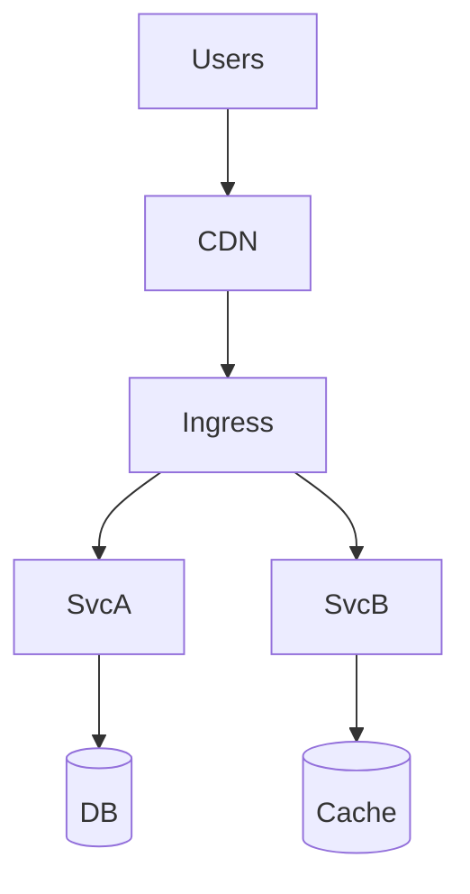

## 13. Infrastructure, Kubernetes, and CI/CD

Ship reliably with containers, orchestration, and automated pipelines.

### Containers and Images
- **Minimal base images; distroless; multi-stage builds; SBOMs and signatures**
  - **Minimal base images**: Use small base images (Alpine, distroless)
  - **Distroless**: Images without package manager or shell
  - **Multi-stage builds**: Build in one stage, run in another
  - **SBOMs**: Software Bill of Materials for security
  - **Signatures**: Sign images to verify authenticity
  - **Example**: Build with Maven in one stage, run with distroless Java in another

- **Resource requests/limits; CPU throttling vs memory OOM behavior**
  - **Resource requests**: Guaranteed resources for the container
  - **Resource limits**: Maximum resources the container can use
  - **CPU throttling**: CPU is throttled when limit is reached
  - **Memory OOM**: Container is killed when memory limit is exceeded
  - **Example**: Request 100m CPU, 128Mi memory; limit 200m CPU, 256Mi memory

**Key insight**: Good container design improves security, performance, and reliability. Plan resource requirements carefully.

### Kubernetes Primitives
- **Deployments, StatefulSets, Jobs/CronJobs; Services and Ingress/Gateway API**
  - **Deployments**: Stateless application deployments with rolling updates
  - **StatefulSets**: Stateful applications with stable network identities
  - **Jobs/CronJobs**: One-time and scheduled batch jobs
  - **Services**: Stable network endpoints for pods
  - **Ingress**: HTTP/HTTPS routing to services
  - **Gateway API**: Next-generation ingress (still evolving)

- **ConfigMaps/Secrets; HPA/VPA/KEDA; PodDisruptionBudgets; anti-affinity**
  - **ConfigMaps**: Configuration data for applications
  - **Secrets**: Sensitive data (passwords, keys)
  - **HPA**: Horizontal Pod Autoscaler based on metrics
  - **VPA**: Vertical Pod Autoscaler for resource optimization
  - **KEDA**: Kubernetes Event-driven Autoscaling
  - **PodDisruptionBudgets**: Protect pods during maintenance
  - **Anti-affinity**: Spread pods across nodes for high availability

**Why this matters**: Kubernetes primitives provide the building blocks for reliable applications. Understanding them is essential for production deployments.

### Service Mesh and Gateways
- **mTLS, retries, timeouts, traffic shifting, policy; rate limiting at gateway**
  - **mTLS**: Mutual TLS for service-to-service authentication
  - **Retries**: Automatic retry policies for failed requests
  - **Timeouts**: Request timeouts to prevent hanging connections
  - **Traffic shifting**: Gradual traffic migration between versions
  - **Policy**: Access control and rate limiting
  - **Rate limiting**: Protect services from overload

**Key insight**: Service mesh provides infrastructure-level features that applications don't need to implement. Use it for cross-cutting concerns.

### CI/CD
- **Build → test → scan → sign → deploy; canary and auto-rollbacks**
  - **Build**: Compile and package application
  - **Test**: Run unit, integration, and end-to-end tests
  - **Scan**: Security and vulnerability scanning
  - **Sign**: Sign artifacts for authenticity
  - **Deploy**: Deploy to target environment
  - **Canary**: Deploy to small subset of users first
  - **Auto-rollbacks**: Automatically revert on failure

- **Infra-as-Code (Terraform/Helm/Kustomize); GitOps; drift detection**
  - **Terraform**: Infrastructure provisioning and management
  - **Helm**: Kubernetes package manager
  - **Kustomize**: Kubernetes native configuration management
  - **GitOps**: Use Git as source of truth for deployments
  - **Drift detection**: Identify configuration differences
  - **Example**: Store Kubernetes manifests in Git, use ArgoCD for deployment

**Why this matters**: Good CI/CD practices enable rapid, reliable deployments. Poor CI/CD leads to deployment failures and rollbacks.

### Cost and Reliability
- **Autoscaling policies; right-sizing; spot capacity with graceful eviction**
  - **Autoscaling policies**: Scale based on demand
  - **Right-sizing**: Match resources to actual needs
  - **Spot capacity**: Use cheaper, interruptible instances
  - **Graceful eviction**: Handle spot instance termination gracefully
  - **Example**: Scale to 10 pods during peak, 2 during off-peak

- **Multi-AZ resilience; multi-region routing and data strategy**
  - **Multi-AZ**: Deploy across multiple availability zones
  - **Multi-region**: Deploy across multiple regions
  - **Routing**: Route traffic to closest region
  - **Data strategy**: Plan for data replication and consistency
  - **Example**: Primary region in US-East, backup in US-West

**Key insight**: Infrastructure decisions affect both cost and reliability. Balance them based on business requirements.

### Interview Checklist
- **Deployment/rollback strategy; config/secret management**
  - Explain your deployment approach
  - Show you understand configuration management
- **Autoscaling and budgets; failure domains; multi-AZ/region plan**
  - Demonstrate understanding of scaling and reliability
  - Show you have a plan for failures
- **CI/CD controls, artifact security, and supply-chain hardening**
  - Explain your CI/CD security approach
  - Show you understand supply chain security

### Diagram (K8s Ingress to Services)

**Use this template**: It shows the basic Kubernetes architecture. Customize based on your specific needs.

### Progressive Delivery
- **Canary deployments with automated rollback on SLO regression; feature flags for dark launches**
  - **Canary**: Deploy to small subset, monitor, then expand
  - **Automated rollback**: Revert on SLO violations
  - **Feature flags**: Control feature rollout independently of deployment
  - **Dark launches**: Deploy features without user impact
  - **Example**: Deploy to 5% of users, monitor for 10 minutes, rollback if errors > 1%

**Key insight**: Progressive delivery reduces deployment risk and enables rapid iteration.

### Infrastructure as Code Best Practices
- **Version control**: Store all infrastructure code in Git
- **Modularity**: Break infrastructure into reusable modules
- **Testing**: Test infrastructure changes before applying
- **Documentation**: Document infrastructure decisions and patterns
- **Review process**: Require code review for infrastructure changes

**Why this matters**: Infrastructure as code improves reliability, repeatability, and collaboration.

### Security Considerations
- **Image scanning**: Scan container images for vulnerabilities
- **Secret management**: Use Kubernetes secrets or external secret managers
- **Network policies**: Restrict pod-to-pod communication
- **RBAC**: Role-based access control for Kubernetes resources
- **Pod security standards**: Apply security policies to pods

**Key insight**: Security should be built into infrastructure from the beginning.

### Monitoring and Observability
- **Resource monitoring**: Monitor CPU, memory, and network usage
- **Application monitoring**: Monitor application health and performance
- **Infrastructure monitoring**: Monitor cluster health and capacity
- **Log aggregation**: Centralize logs from all components
- **Alerting**: Alert on infrastructure issues

**Why this matters**: Good monitoring enables proactive problem detection and resolution.

### Disaster Recovery
- **Backup strategies**: Backup etcd and persistent volumes
- **Recovery procedures**: Document recovery steps
- **Testing**: Regularly test disaster recovery procedures
- **Multi-region**: Deploy across multiple regions
- **Data replication**: Replicate critical data

**Key insight**: Disaster recovery planning is essential for production systems.

### Additional Resources for Deep Study
- **Books**: "Kubernetes: Up and Running" by Brendan Burns (Kubernetes fundamentals)
- **Practice**: Set up local Kubernetes cluster and deploy applications
- **Real-world**: Study how companies use Kubernetes in production
- **Tools**: Learn Terraform, Helm, and other infrastructure tools

**Study strategy**: Understand the fundamentals, practice with local clusters, then study real-world implementations to understand practical constraints.

