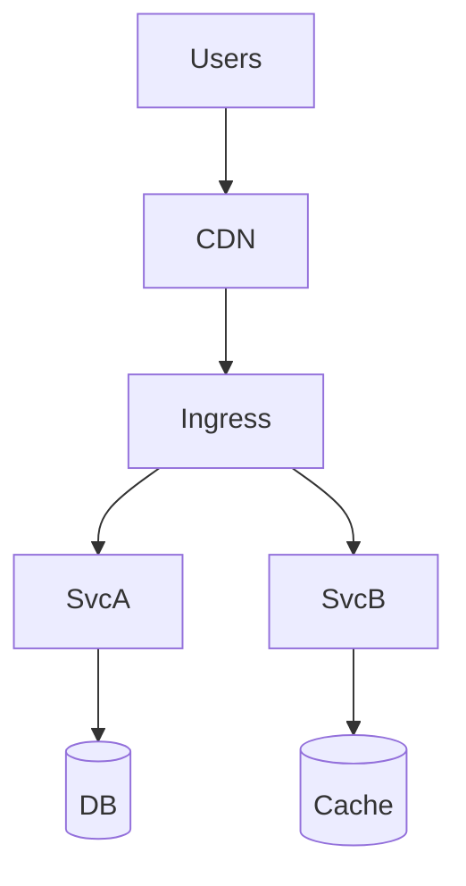

## 13. Infrastructure, Kubernetes, and CI/CD

Ship reliably with containers, orchestration, and automated pipelines.

### Containers and Images
- Minimal base images; distroless; multi-stage builds; SBOMs and signatures
- Resource requests/limits; CPU throttling vs memory OOM behavior

### Kubernetes Primitives
- Deployments, StatefulSets, Jobs/CronJobs; Services and Ingress/Gateway API
- ConfigMaps/Secrets; HPA/VPA/KEDA; PodDisruptionBudgets; anti-affinity

### Service Mesh and Gateways
- mTLS, retries, timeouts, traffic shifting, policy; rate limiting at gateway

### CI/CD
- Build → test → scan → sign → deploy; canary and auto-rollbacks
- Infra-as-Code (Terraform/Helm/Kustomize); GitOps; drift detection

### Cost and Reliability
- Autoscaling policies; right-sizing; spot capacity with graceful eviction
- Multi-AZ resilience; multi-region routing and data strategy

### Interview Checklist
- Deployment/rollback strategy; config/secret management
- Autoscaling and budgets; failure domains; multi-AZ/region plan
- CI/CD controls, artifact security, and supply-chain hardening

### Diagram (K8s Ingress to Services)

### Progressive Delivery
- Canary deployments with automated rollback on SLO regression; feature flags for dark launches.

