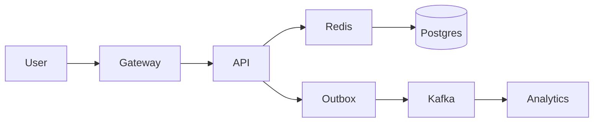

## 15. Case Studies and Exercises

Practice end-to-end design with constraints and evaluation rubrics.

### Exercise 1: URL Shortener
- Constraints: 100M new/day, 1k QPS writes, 50k QPS reads, 99.99% availability
- Focus: ID generation (Base62, Snowflake), cache-aside, consistent hashing, analytics pipeline

### Exercise 2: Multi-tenant Rate Limiter
- Token bucket at gateway + per-tenant quotas; Redis sharded counters; leaky bucket smoothing

### Exercise 3: News Feed
- Write-optimized: outbox → fanout to per-user inbox; hot user mitigation; caching; search for people/topics

### Exercise 4: Chat/Messaging
- WebSocket fanout; presence; ordering per conversation; storage tiers; typing/read receipts

### Exercise 5: File Storage (Drive/Dropbox)
- Chunking, dedup (content hashes), metadata DB, object storage, CDN, sharing ACLs

### Exercise 6: Notification Service
- Multi-channel routing (email, SMS, push); retries, DLQ, user preferences, quiet hours

### Evaluation Rubric
- Requirements quantified; HLD coherent; NFR alignment
- Deep dives with correct trade-offs; failure handling; operability
- Clear evolution plan and cost awareness

### Talk Tracks (samples)
- URL Shortener: "Public API behind gateway with token bucket. IDs via Snowflake or Base62 from DB sequence with caching; cache-aside for hot redirects (target 95% hit), consistent hashing for cache shards. Writes: tx insert slug→URL + outbox → consumer updates analytics. Read path: CDN caches 301s for popular links, signed admin APIs for management."

### Diagram (Shortener HLD)

