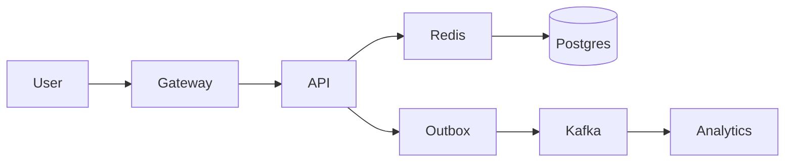

## 15. Case Studies and Exercises

Practice end-to-end design with constraints and evaluation rubrics.

### Exercise 1: URL Shortener
- **Constraints: 100M new/day, 1k QPS writes, 50k QPS reads, 99.99% availability**
  - **Scale**: High volume with read-heavy workload
  - **Availability**: Very high availability requirement
  - **Focus areas**: ID generation, caching, analytics

- **Focus: ID generation (Base62, Snowflake), cache-aside, consistent hashing, analytics pipeline**
  - **ID generation**: Choose between sequential, hash-based, or distributed IDs
  - **Cache-aside**: Cache popular URLs for fast access
  - **Consistent hashing**: Distribute cache load evenly
  - **Analytics pipeline**: Track click-through rates and user behavior

**Key insights**:
- Read traffic is much higher than write traffic
- ID generation affects scalability and collision probability
- Analytics are important for business value

### Exercise 2: Multi-tenant Rate Limiter
- **Token bucket at gateway + per-tenant quotas; Redis sharded counters; leaky bucket smoothing**
  - **Token bucket**: Allow bursts up to bucket capacity
  - **Per-tenant quotas**: Different limits for different customers
  - **Redis sharded counters**: Distribute rate limiting across multiple nodes
  - **Leaky bucket**: Smooth traffic for better user experience

**Key insights**:
- Rate limiting must be distributed and fast
- Different tenants have different needs
- Smoothing improves user experience

### Exercise 3: News Feed
- **Write-optimized: outbox → fanout to per-user inbox; hot user mitigation; caching; search for people/topics**
  - **Write-optimized**: Optimize for content creation, not consumption
  - **Outbox pattern**: Reliable event publishing
  - **Fanout**: Distribute content to user inboxes
  - **Hot user mitigation**: Handle celebrity users with high follower counts
  - **Caching**: Cache user feeds for fast access
  - **Search**: Enable discovery of people and topics

**Key insights**:
- Write-optimized feeds scale better than read-optimized
- Hot users can cause performance cliffs
- Search is essential for content discovery

### Exercise 4: Chat/Messaging
- **WebSocket fanout; presence; ordering per conversation; storage tiers; typing/read receipts**
  - **WebSocket fanout**: Real-time message delivery
  - **Presence**: Show who's online and typing
  - **Ordering**: Ensure messages are delivered in order within conversations
  - **Storage tiers**: Different storage for different message ages
  - **Typing/read receipts**: Real-time user experience features

**Key insights**:
- Real-time systems have different scaling challenges
- Presence updates can be bursty
- Message ordering is critical for user experience

### Exercise 5: File Storage (Drive/Dropbox)
- **Chunking, dedup (content hashes), metadata DB, object storage, CDN, sharing ACLs**
  - **Chunking**: Split large files into manageable pieces
  - **Deduplication**: Store unique content only once
  - **Metadata DB**: Store file information and relationships
  - **Object storage**: Store file chunks efficiently
  - **CDN**: Distribute popular content globally
  - **Sharing ACLs**: Control access to shared files

**Key insights**:
- Deduplication saves significant storage costs
- Metadata management is complex but essential
- CDN dramatically improves global performance

### Exercise 6: Notification Service
- **Multi-channel routing (email, SMS, push); retries, DLQ, user preferences, quiet hours**
  - **Multi-channel**: Support multiple notification types
  - **Routing**: Choose appropriate channel for each notification
  - **Retries**: Handle delivery failures gracefully
  - **DLQ**: Store failed notifications for investigation
  - **User preferences**: Allow users to control notification settings
  - **Quiet hours**: Respect user preferences for timing

**Key insights**:
- Multi-channel support increases complexity
- User preferences are critical for engagement
- Failure handling is essential for reliability

### Evaluation Rubric
- **Requirements quantified**: Clear, measurable requirements
- **HLD coherent**: High-level design makes sense
- **NFR alignment**: Design meets non-functional requirements
- **Deep dives with correct trade-offs**: Show understanding of key decisions
- **Failure handling**: Plan for common failure scenarios
- **Operability**: System can be operated effectively
- **Clear evolution plan**: How the system will grow over time
- **Cost awareness**: Understanding of cost implications

**Use this rubric**: It helps evaluate both your own designs and others'.

### Talk Tracks (samples)
- **URL Shortener**: "Public API behind gateway with token bucket. IDs via Snowflake or Base62 from DB sequence with caching; cache-aside for hot redirects (target 95% hit), consistent hashing for cache shards. Writes: tx insert slug→URL + outbox → consumer updates analytics. Read path: CDN caches 301s for popular links, signed admin APIs for management."

**Practice these**: They're good baselines that cover all the key points. Customize for your specific examples.

### Diagram (Shortener HLD)

**Use this template**: It shows the complete flow from user to analytics. Customize based on your specific system.

### Additional Exercises
- **E-commerce platform**: Handle high traffic, inventory management, payment processing
- **Social media platform**: Handle viral content, content moderation, recommendation engine
- **Video streaming service**: Handle video delivery, transcoding, content distribution
- **Ride-sharing app**: Handle real-time location, matching, payment processing
- **E-learning platform**: Handle video streaming, progress tracking, content management

**Practice these**: They cover different domains and scaling challenges.

### Design Patterns to Practice
- **Event sourcing**: Store all changes as events
- **CQRS**: Separate read and write models
- **Saga pattern**: Handle distributed transactions
- **Outbox pattern**: Reliable event publishing
- **Circuit breaker**: Handle failing dependencies gracefully

**Learn these patterns**: They're common in distributed systems and often come up in interviews.

### Common Pitfalls to Avoid
- **Over-engineering**: Don't add complexity you don't need
- **Ignoring failure modes**: Plan for what can go wrong
- **Missing operational concerns**: Consider how the system will be operated
- **Poor capacity planning**: Don't underestimate scale requirements
- **Ignoring security**: Security should be designed in from the beginning

**Avoid these**: They're common mistakes that can sink your design.

### Additional Resources for Deep Study
- **Books**: "System Design Interview" by Alex Xu (comprehensive coverage)
- **Practice**: Use platforms like LeetCode, Grokking, or System Design Primer
- **Real-world**: Study how companies like Netflix, Uber, and Twitter handle scale
- **Mock interviews**: Practice with peers or mentors

**Study strategy**: Practice regularly, get feedback, and learn from real-world examples.

